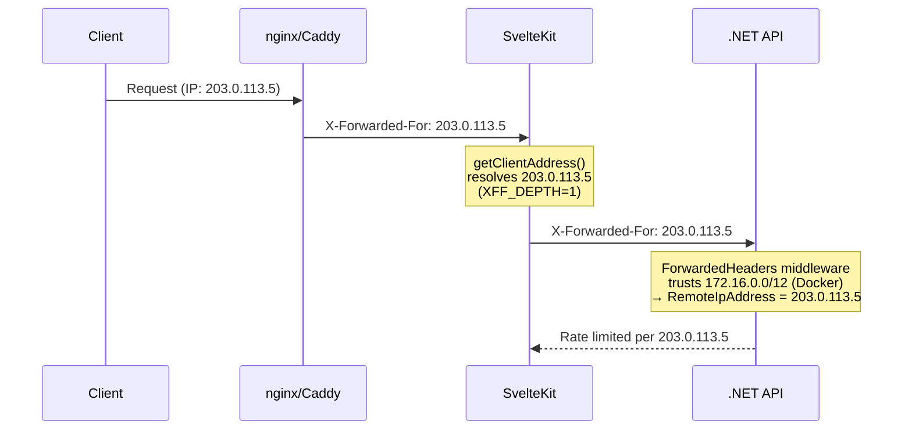

# Email Resilience & Config-Driven Hosting

**Date**: 2026-02-16
**Scope**: Graceful email delivery failure handling, real client IP forwarding through SvelteKit proxy, and unified HostingOptions for deployment configuration

## Summary

Fixed two issues: (1) registration/forgot-password returning 500 when the email provider is down (#190), and (2) all users sharing the same rate-limit bucket when SvelteKit proxies to the backend on the same host (#192). The rate-limit fix evolved into a comprehensive `HostingOptions` configuration that centralizes reverse proxy trust, HTTPS enforcement, and platform-specific deployment settings.

## Changes Made

| File | Change | Reason |
|------|--------|--------|
| `Infrastructure/.../AuthenticationService.cs` | Added `SendEmailSafeAsync` private helper wrapping email sends in try/catch | Email delivery is a non-critical side effect; failure should be logged, not propagated (#190) |
| `Component.Tests/.../AuthenticationServiceTests.cs` | Added 2 tests: `Register_EmailSendFails_StillReturnsSuccess`, `ForgotPassword_EmailSendFails_StillReturnsSuccess` | Verify email failures don't propagate |
| `frontend/src/routes/api/[...path]/+server.ts` | Forward `X-Forwarded-For` via `getClientAddress()` in proxy | Backend needs real client IP for per-user rate limiting (#192) |
| `WebApi/Options/HostingOptions.cs` | New: root hosting config with `ForceHttps` and nested `ReverseProxyOptions` | Centralized, config-driven deployment settings |
| `WebApi/Extensions/HostingExtensions.cs` | New: registers options, applies forwarded headers + HTTPS middleware | Replaces `ForwardedHeadersExtensions.cs` |
| `WebApi/Options/ReverseProxyOptions.cs` | Deleted | Replaced by nested type in `HostingOptions` |
| `WebApi/Extensions/ForwardedHeadersExtensions.cs` | Deleted | Replaced by `HostingExtensions` |
| `WebApi/Program.cs` | `AddHostingOptions`/`UseHostingMiddleware`; removed hardcoded HTTPS override | Config-driven instead of environment-based |
| `appsettings.json` | Added `Hosting` section (ForceHttps: true, empty trust lists) | Production defaults |
| `appsettings.Development.json` | Added `Hosting: { ForceHttps: false }` | No HTTPS in local dev |
| `appsettings.Testing.json` | Added `Hosting: { ForceHttps: false }` | No HTTPS in tests |
| `docker-compose.local.yml` | `Hosting__ReverseProxy__TrustedNetworks__0: 172.16.0.0/12` | Trust Docker bridge for forwarded headers |
| `.env.example` | Documented Hosting section with platform hints | Guide for deployment configuration |
| `src/backend/AGENTS.md` | Hosting Configuration section with platform deployment table | Document Docker/K8s/AWS/Azure/Cloudflare/Coolify config |
| `src/frontend/AGENTS.md` | Updated API Proxy section: X-Forwarded-For, XFF_DEPTH | Document proxy header forwarding |
| `FILEMAP.md` | Added `HostingOptions.cs` and `HostingExtensions.cs` impact rows | Change impact tracking |

## Decisions & Reasoning

### Fire-and-forget email pattern over Result wrapping

- **Choice**: `SendEmailSafeAsync` — try/catch with logging, swallow exception
- **Alternatives considered**: Returning `Result<T>` from email sends, background queue with retry
- **Reasoning**: Email is a side effect of registration/forgot-password, not the primary operation. Failing the user-facing request because of a transient email provider issue is wrong. A `Result` would force callers to handle a failure they can't meaningfully recover from. Background queues (Polly/Hangfire) are tracked in issue #194 for future implementation.

### HostingOptions with nested ReverseProxyOptions

- **Choice**: Single `HostingOptions` class with nested `ReverseProxyOptions` type
- **Alternatives considered**: Standalone `ReverseProxyOptions` class, reusing ASP.NET's `ForwardedHeadersOptions` directly in config
- **Reasoning**: Naming collision — ASP.NET Core has its own `ForwardedHeadersOptions` in `Microsoft.AspNetCore.Builder`. A standalone `ReverseProxyOptions` works but doesn't scale when adding other deployment concerns (HTTPS, cloud-specific settings). Nesting under `HostingOptions` gives a clean `Hosting:ReverseProxy:TrustedNetworks` config path and room to grow (e.g., future cloud-specific nested types).

### Config-driven ForceHttps over environment-based check

- **Choice**: `HostingOptions.ForceHttps` boolean (default: `true`)
- **Alternatives considered**: `if (app.Environment.IsProduction())` hardcoded check
- **Reasoning**: The hardcoded check assumes only production needs HTTPS scheme override, but staging environments behind TLS proxies need it too. A config flag lets any environment opt in/out. Development and Testing appsettings override to `false`.

### getClientAddress() for real client IP

- **Choice**: SvelteKit's `getClientAddress()` to populate `X-Forwarded-For`
- **Alternatives considered**: Reading `X-Forwarded-For` from incoming request, using `event.platform` APIs
- **Reasoning**: `getClientAddress()` is the canonical SvelteKit API for resolving the connecting client's IP. When behind nginx/Caddy, it reads `XFF_DEPTH` to determine which hop to trust. The frontend proxy then forwards this IP to the backend, which trusts it based on `HostingOptions.ReverseProxy.TrustedNetworks`.

## Diagrams

## Follow-Up Items

- [ ] Issue #194: Add Polly resilience policies (retry, circuit breaker) to HttpClient registrations
- [ ] Manual testing: verify per-user rate limiting in Docker Compose with multiple clients
- [ ] Consider excluding `appsettings.Development.json` and `appsettings.Testing.json` from production Docker images
