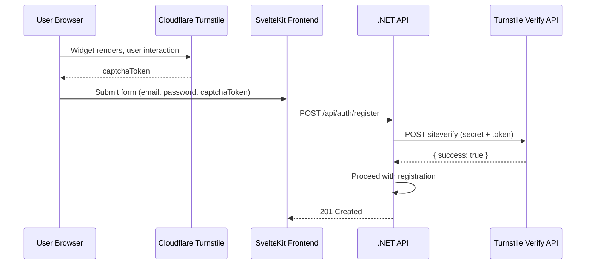

# Cloudflare Turnstile CAPTCHA

**Date**: 2026-02-16
**Scope**: Add CAPTCHA protection to Register and ForgotPassword endpoints using Cloudflare Turnstile

## Summary

Added Cloudflare Turnstile CAPTCHA to the Register and Forgot Password flows to protect against automated abuse. The implementation spans all layers: a new `ICaptchaService` with `TurnstileCaptchaService` on the backend, a `TurnstileWidget` Svelte 5 component on the frontend, and comprehensive test coverage. No new NuGet or npm packages were needed — both sides use vanilla HTTP/JS APIs.

## Changes Made

| File | Change | Reason |
|------|--------|--------|
| `src/backend/Netrock.Application/Features/Captcha/ICaptchaService.cs` | New interface | Clean Architecture abstraction for captcha verification |
| `src/backend/Netrock.Infrastructure/Features/Captcha/Options/CaptchaOptions.cs` | New options class | Typed configuration with `ValidateOnStart` |
| `src/backend/Netrock.Infrastructure/Features/Captcha/Services/TurnstileCaptchaService.cs` | New service | Server-side Turnstile token verification via `HttpClient` |
| `src/backend/Netrock.Infrastructure/Features/Captcha/Extensions/ServiceCollectionExtensions.cs` | New DI extension | C# 13 extension syntax, registers options + typed HttpClient |
| `src/backend/Netrock.Shared/ErrorMessages.cs` | Added `CaptchaInvalid` | Consistent error message for captcha failures |
| `src/backend/Netrock.WebApi/Program.cs` | Added `AddCaptchaServices` | Service registration |
| `src/backend/Netrock.WebApi/appsettings.*.json` | Added `Captcha` section | Configuration for all environments |
| `src/backend/Netrock.WebApi/.../RegisterRequest.cs` | Added `CaptchaToken` property | Required field for captcha token |
| `src/backend/Netrock.WebApi/.../ForgotPasswordRequest.cs` | Added `CaptchaToken` property | Required field for captcha token |
| `src/backend/Netrock.WebApi/.../RegisterRequestValidator.cs` | Added `NotEmpty` rule | FluentValidation for captcha token |
| `src/backend/Netrock.WebApi/.../ForgotPasswordRequestValidator.cs` | Added `NotEmpty` rule | FluentValidation for captcha token |
| `src/backend/Netrock.WebApi/.../AuthController.cs` | Injected `ICaptchaService`, added validation | Gate Register/ForgotPassword behind captcha check |
| `src/frontend/src/lib/components/auth/TurnstileWidget.svelte` | New component | Svelte 5 wrapper for Cloudflare Turnstile explicit render API |
| `src/frontend/src/lib/components/auth/RegisterDialog.svelte` | Widget integration, submit-gate | Captcha required before registration |
| `src/frontend/src/lib/components/auth/ForgotPasswordForm.svelte` | Widget integration, submit-gate | Captcha required before password reset |
| `src/frontend/src/app.d.ts` | Added `Window.turnstile` type | TypeScript support for Turnstile global |
| `src/frontend/src/messages/{en,cs}.json` | Added `auth_captcha_error` | i18n for captcha failure |
| `src/frontend/.env.example` | Added `PUBLIC_TURNSTILE_SITE_KEY` | Site key env var placeholder |
| `tests/.../CustomWebApplicationFactory.cs` | Added `ICaptchaService` mock | Test infrastructure |
| `tests/.../AuthControllerTests.cs` | Updated + 4 new tests | Captcha token in payloads, invalid/missing scenarios |
| `tests/.../RegisterRequestValidatorTests.cs` | Updated valid fixture | Include `CaptchaToken` |
| `tests/.../ForgotPasswordRequestValidatorTests.cs` | Updated valid fixture | Include `CaptchaToken` |

## Decisions & Reasoning

### Cloudflare Turnstile over alternatives (reCAPTCHA, hCaptcha, custom HMAC)

- **Choice**: Cloudflare Turnstile
- **Alternatives considered**: Google reCAPTCHA v3, hCaptcha, custom HMAC-based challenge
- **Reasoning**: Free, no image puzzles (better UX), privacy-friendly, massively battle-tested infrastructure. Server-side verification is a single HTTP POST — no challenge stores, no HMAC keys, no replay prevention logic needed on our side.

### No new packages (NuGet or npm)

- **Choice**: Plain `HttpClient.PostAsync` on backend, vanilla JS `api.js?render=explicit` on frontend
- **Alternatives considered**: Turnstile NuGet wrapper, `@marsidev/react-turnstile` (npm)
- **Reasoning**: The API surface is minimal (one POST, one script load + render call). Adding packages for this would be over-engineering. Fewer dependencies = fewer supply chain risks.

### Fail closed on verification errors

- **Choice**: Return `false` (reject) on any HTTP failure or exception from Cloudflare
- **Alternatives considered**: Fail open (allow on error), queue for manual review
- **Reasoning**: Security-restrictive-by-default per project convention. A brief Cloudflare outage blocking registrations is preferable to allowing bots through.

### Site key delivery via `PUBLIC_` env var

- **Choice**: `PUBLIC_TURNSTILE_SITE_KEY` SvelteKit env var
- **Alternatives considered**: API endpoint that returns config, hardcoded in component
- **Reasoning**: Site key is public (non-secret) but environment-specific. SvelteKit's `PUBLIC_` prefix makes it available client-side at build time with zero API calls.

## Diagrams

## Follow-Up Items

- [ ] Manual test: register form with Turnstile widget
- [ ] Manual test: forgot-password form with Turnstile widget
- [ ] Configure production Turnstile site key + secret key in deployment secrets
