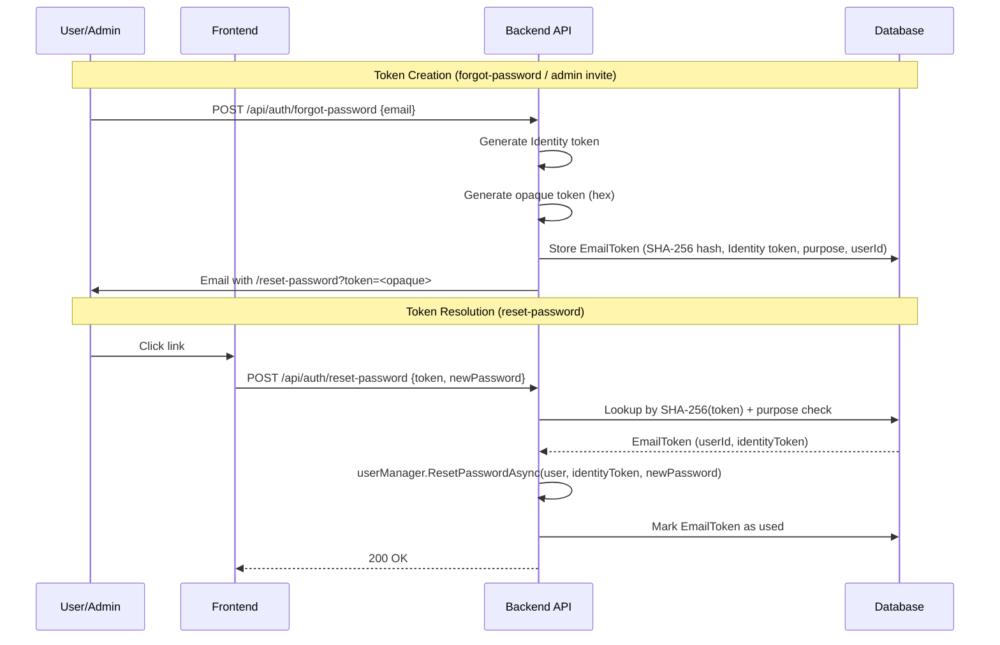

# Anonymize Email Tokens

**Date**: 2026-02-17
**Scope**: Remove PII (email addresses) from password-reset and email-verification URLs by introducing opaque tokens backed by a database lookup

## Summary

Introduced an `EmailToken` entity that maps cryptographically random opaque tokens to ASP.NET Identity tokens + users. URLs changed from `?token=<identity_token>&email=user@example.com` to `?token=<opaque>`, eliminating PII leakage into browser history, server logs, referrer headers, and proxy logs per the OWASP Forgot Password Cheat Sheet.

In a follow-up commit, extracted `CreateEmailTokenAsync`/`ResolveEmailTokenAsync` into a shared `EmailTokenService` to unify token creation across both `AuthenticationService` and `AdminService` (admin invite and admin-triggered password reset were still using the old pattern).

## Changes Made

| File | Change | Reason |
|------|--------|--------|
| `Infrastructure/.../Models/EmailToken.cs` | New entity (Token hash, IdentityToken, Purpose, ExpiresAt, IsUsed, UserId) | Maps opaque URL tokens to Identity tokens in DB |
| `Infrastructure/.../Models/EmailTokenPurpose.cs` | New enum: `PasswordReset`, `EmailVerification` | Prevents cross-purpose token replay |
| `Infrastructure/.../Configurations/EmailTokenConfiguration.cs` | EF config in `auth` schema with unique index on Token | DB mapping with `Is*` -> prefix-free column names |
| `Infrastructure/.../Services/EmailTokenService.cs` | New shared internal service with `CreateAsync` and `ResolveAsync` | Unified token creation/resolution for all consumers |
| `Infrastructure/.../Services/AuthenticationService.cs` | Delegates to `EmailTokenService`, removed private helpers | DRY — single source of truth for token lifecycle |
| `Infrastructure/.../Services/AdminService.cs` | Replaced `BuildPasswordResetUrl(token, email)` with opaque token flow | Admin invite and admin password reset now use opaque tokens |
| `Infrastructure/.../Options/AuthenticationOptions.cs` | Added `EmailTokenOptions` (TokenLengthInBytes, ExpiresInHours) | Configurable token generation parameters |
| `Infrastructure/.../Extensions/ServiceCollectionExtensions.cs` | Registered `EmailTokenService` as scoped | DI wiring |
| `Persistence/NetrockDbContext.cs` | Added `DbSet<EmailToken>` | EF access to new entity |
| `Application/.../Dtos/ResetPasswordInput.cs` | Removed `Email` parameter | No longer needed — resolved from opaque token |
| `Application/.../Dtos/VerifyEmailInput.cs` | Removed `Email` parameter | Same reason |
| `WebApi/.../Dtos/ResetPassword/ResetPasswordRequest.cs` | Removed `Email` property | API contract change |
| `WebApi/.../Dtos/VerifyEmail/VerifyEmailRequest.cs` | Removed `Email` property | API contract change |
| `WebApi/.../Dtos/*/Validator.cs` | Removed email validation rules | Property no longer exists |
| `WebApi/.../AuthMapper.cs` | Removed `Email` from mappings | Property no longer exists |
| `frontend/.../reset-password/*` | Removed `email` from URL params and form | Only `token` needed |
| `frontend/.../verify-email/*` | Removed `email` from URL params and POST body | Only `token` needed |
| `frontend/.../ResetPasswordForm.svelte` | Removed `email` prop | Only `token` needed |
| `frontend/.../api/v1.d.ts` | Regenerated — removed `email` from request schemas | Matches backend API changes |
| `tests/.../AuthenticationServiceTests.cs` | Rewrote reset/verify tests with `SeedEmailTokenAsync` helper | Tests seed opaque tokens and verify DB state |
| `tests/.../AdminServiceTests.cs` | Added opaque token assertions, injected `EmailTokenService` | Verifies no email in URLs, tokens persisted correctly |
| `tests/.../AuthControllerTests.cs` | Removed `email` from request bodies | API contract change |
| `tests/.../Validator tests` | Removed email validation tests | Property no longer exists |
| `.env.example` | Added `EmailToken` config documentation | Discoverability |

## Decisions & Reasoning

### Shared EmailTokenService vs duplicated private methods

- **Choice**: Extract into a shared `EmailTokenService` internal class registered in DI
- **Alternatives considered**: (1) Duplicate private methods in both services, (2) Application-layer interface
- **Reasoning**: Both `AuthenticationService` and `AdminService` are in Infrastructure, so an internal class avoids an unnecessary abstraction layer while eliminating code duplication. An Application-layer interface was rejected because `EmailToken` and `EmailTokenPurpose` are Infrastructure concerns.

### SHA-256 hashing of tokens before storage

- **Choice**: Store `HashHelper.Sha256(rawToken)` in DB, return raw token in URL
- **Alternatives considered**: Storing raw token directly
- **Reasoning**: Follows the existing `RefreshToken` pattern. If the DB is compromised, attackers cannot reconstruct valid URL tokens from the hashes.

### Configurable token parameters via options

- **Choice**: `EmailTokenOptions` nested in `AuthenticationOptions` with `TokenLengthInBytes` (default 32) and `ExpiresInHours` (default 24)
- **Alternatives considered**: Hard-coded values
- **Reasoning**: Production deployments may need different expiry windows. 256-bit tokens provide sufficient entropy for URL tokens.

## Diagrams

## Follow-Up Items

- [ ] Token cleanup job — recurring Hangfire job to purge expired/used EmailTokens (mentioned in PR #222)
